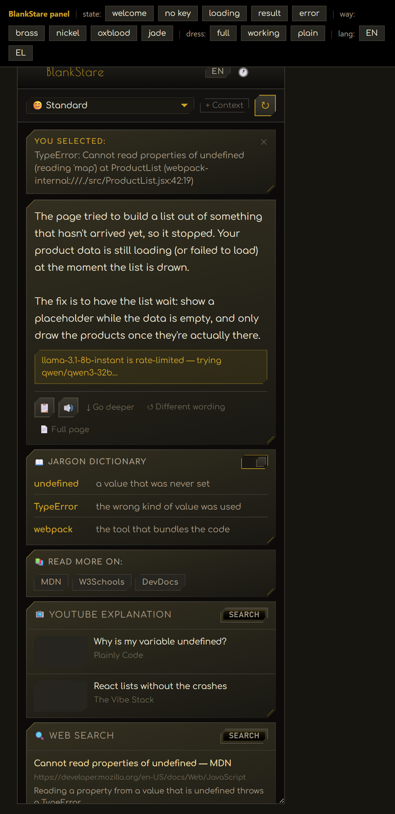
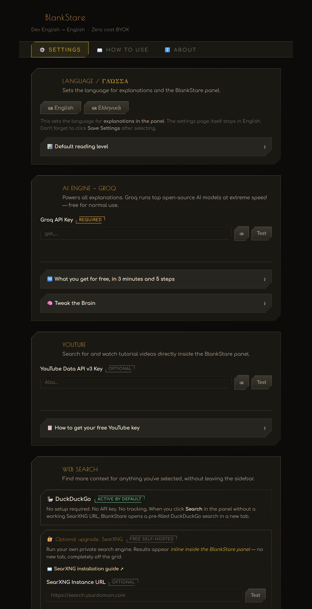

# ⚡ BlankStare: Dev English to English

> **Zero cost BYOK** — Bring Your Own (free) API Key. No subscription. No hidden fees.

📘 **Guides:** [docs.stravelakis.com/BlankStare-Dev-English-to-English](https://docs.stravelakis.com/BlankStare-Dev-English-to-English/) — for developers, in plain English, and ELI5.

**Translate developer documentation, error messages, READMEs, terminal output, and tech jargon into plain English — instantly, while you browse.**

A Chrome sidebar extension powered by Groq's free AI API. Built first for **vibecoders** — people building real things with AI coding tools (Claude Code, Cursor, Antigravity, etc.) without a traditional dev background — and just as useful for anyone else who works alongside developers: designers, project managers, founders, marketers, and anyone who's ever got a blank stare from reading developer docs.

---

## Screenshots

| The panel, mid-translation | Settings |
|---|---|
|  |  |

The panel wears [Deco Noir](#-look--feel): a chamfer on two opposing corners,
brass on near-black. Greek titles are set in GFS Didot and Latin ones in Poiret
One, chosen per glyph — visible on the settings page, where "LANGUAGE / ΓΛΩΣΣΑ"
uses both faces in a single line.

---

## ✨ Features

| Feature | Details |
|---|---|
| 🧠 **AI explanations** | Groq streaming, word-by-word. 4 reading levels (ELI5 🍼 → Vibecoder 🤖). |
| 🔁 **9 free AI models** | Auto-fallback hops to the next model if one hits a rate limit. |
| 🎙️ **Text-to-speech** | Orpheus expressive voices (8 to choose from) or free browser voice. |
| 🌐 **Greek & English** | Full EN/EL toggle — UI, explanations, and voice readout. |
| 📖 **Jargon dictionary** | Identifies every technical term with a 2-10 word definition. |
| 🕐 **Session history** | Last 20 explanations — click any to reload instantly. |
| 📋 **Copy** | Copy any explanation to clipboard in one click. |
| ↓ **Go deeper · ↺ Rephrase** | Follow-up prompts without re-selecting text. |
| ↻ **Re-explain** | Change language/level/context — button turns amber to re-run instantly. |
| 📄 **Full page summary** | Summarises the entire current page in 3-5 bullet points. |
| 💬 **Custom question** | Ask anything using the selected text as context. |
| 🎯 **Trigger modes** | Floating button + right-click menu (any combination). |
| ⌨️ **Keyboard shortcuts** | `Alt+Shift+B` (open panel) · `Alt+Shift+E` (queue selection). |
| 📺 **YouTube search** | Inline video search and embed (free YouTube API key). |
| 🔍 **Web search** | SearXNG private instance or DuckDuckGo fallback. |
| 📚 **Resource links** | MDN, W3Schools, DevDocs — no API needed. |
| 🚫 **Exclude list** | Silence BlankStare completely on specific domains. |
| 🎬 **Lottie animations** | 12 animated icons, bundled locally. |
| 🔤 **Comfortaa font** | Bundled locally, Greek + Latin, no external requests. |

---

## 🚀 Getting Started

### Install for development (load unpacked)

1. Clone this repository:
   ```
   git clone https://github.com/Stravelakis/BlankStare-Dev-English-to-English.git
   ```
2. Open Chrome → go to `chrome://extensions`
3. Enable **Developer mode** (top-right toggle)
4. Click **Load unpacked** → select the `BlankStare-Dev-English-to-English` folder
5. The extension appears in your toolbar. Click it → Settings opens automatically.

### API Keys

| Key | Where to get it | Required? |
|---|---|---|
| **Groq API key** | [console.groq.com](https://console.groq.com) — free | ✅ Yes |
| **YouTube Data API v3** | [Google Cloud Console](https://console.cloud.google.com) — 100 searches/day free | Optional |
| **SearXNG URL** | Your self-hosted instance | Optional |

> 💡 **Rate limit tip:** Turn on **Auto-fallback** in Settings → AI Engine → Tweak the Brain, and BlankStare will automatically hop to the next of the 9 free models if your current one hits its rate limit — no manual switching needed.

---

## 🗂️ Project Structure

```
BlankStare/
├── manifest.json         ← Extension config (MV3)
├── background.js         ← Service worker — gesture-safe sidePanel coordinator
├── content.js            ← Page-injected — selection, floating button (shadow DOM)
│
├── sidepanel/
│   ├── sidepanel.html    ← Panel UI (all features)
│   ├── sidepanel.js      ← Panel logic — streaming, i18n, history, voice
│   ├── sidepanel.css     ← Panel styles (Deco Noir, brass)
│   └── deco-init.js      ← Identity runtime init (MV3 forbids inline scripts)
│
├── settings/
│   ├── settings.html     ← 3-tab settings (Settings · How to use · About)
│   ├── settings.js       ← Settings logic + animated test buttons
│   └── settings.css      ← Settings styles
│
├── utils/
│   ├── pure.js           ← Testable logic — SSE parsing, URL filtering, prompts
│   ├── api.js            ← All external API calls (Groq, YouTube, SearXNG)
│   ├── storage.js        ← Chrome storage helpers + defaults
│   └── lottie.min.js     ← Bundled Lottie player (168KB, light build)
│
├── vendor/
│   ├── deco-noir.css     ← Visual identity system (vendored, not a dependency)
│   └── deco-noir.js      ← Its optional runtime
│
├── tests/
│   └── pure.test.js      ← `npm test` — no build step, Node's own test runner
│
├── lab/
│   ├── preview.html      ← The panel, rendered without loading the extension
│   └── button-preview.html ← Floating-button isolation test
│
├── fonts/
│   └── comfortaa*.woff2  ← Comfortaa font, Latin + Greek, 400/600/700
│
├── icons/
│   ├── icon*.png         ← Extension icons (16/32/48/128px)
│   └── lottie/           ← 12 animated Lottie JSON icons (amber colour scheme)
│
├── .github/
│   └── ISSUE_TEMPLATE/   ← Bug report + feature request templates
│
└── LICENSE               ← Attribution-required license
```

---

## 🎨 Look & feel

BlankStare wears **Deco Noir** — an art-deco visual identity shared across
these projects. The signature is a chamfer on two opposing corners, top-left
and bottom-right, dressed with a double brass rule.

The system is vendored into `vendor/`, never linked from a CDN: an extension
cannot fetch remote code at runtime, and a CDN font that fails to load
degrades silently to a serif with no error.

Two surfaces, two ornament levels — the side panel is dressed `working`, the
settings page `plain`. The floating button injected into web pages carries the
identity by hand inside a closed shadow root, so neither the button nor the
host page can restyle the other.

To see either surface without loading the extension:

```
npx http-server . -p 8123 -c-1
```

then open `lab/preview.html`.

---

## 🧪 Tests

```
npm test
```

Runs Node's built-in test runner over the pure logic — SSE frame reassembly,
URL scheme filtering, domain exclusion, the Greek heuristic. **There is no
build step and no dependency to install**; `package.json` exists only so
`npm test` has somewhere to live. Loading the extension unpacked works exactly
as before, with or without Node.

---

## 🔧 SearXNG CORS Setup

In your SearXNG `settings.yml`, add:
```yaml
server:
  cors_cors_allowed_origins: "*"
```
Then restart SearXNG. Click **Test** in BlankStare settings to verify.

> 🔐 **Chrome will ask permission for your instance.** BlankStare requests access
> to Groq and YouTube only; it does not ask for blanket access to every site.
> Because your SearXNG instance is self-hosted, its address cannot be known in
> advance, so pressing **Test** asks Chrome for that **one origin** — e.g.
> `https://search.example.com/*`. Decline it and BlankStare simply falls back to
> DuckDuckGo.

---

## 📄 License

**Source Available with Attribution** — see [LICENSE](LICENSE) for full terms.

Short version: free for personal use, forks must credit the original author with a link to [stravelakis.com](https://stravelakis.com). No commercial use without permission.

---

## 👤 About the Creator

**BlankStare** was developed by **Lambros Stravelakis** while building [skilitsa.com](https://skilitsa.com), using **Claude Code** and the **Hermes agent**.

Lambros is available for hire for special projects — web apps, Chrome extensions, AI-powered tools, and product development with AI assistance.

📧 **lambros@stravelakis.com** | 🌐 [stravelakis.com](https://stravelakis.com)

---

## ☕ Support

If BlankStare saves you time, consider buying Lambros a coffee:

**[ko-fi.com/stravelakis](https://ko-fi.com/stravelakis)**

---

## 🐛 Issues & Feature Requests

- **Bug?** → [Open a bug report](https://github.com/Stravelakis/BlankStare-Dev-English-to-English/issues/new?template=bug_report.md)
- **Idea?** → [Request a feature](https://github.com/Stravelakis/BlankStare-Dev-English-to-English/issues/new?template=feature_request.md)

---

*Built with frustration at developer documentation that assumes everyone has a CS degree. If you've ever stared blankly at a README — this is for you.*
