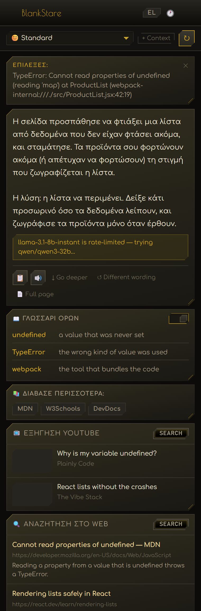
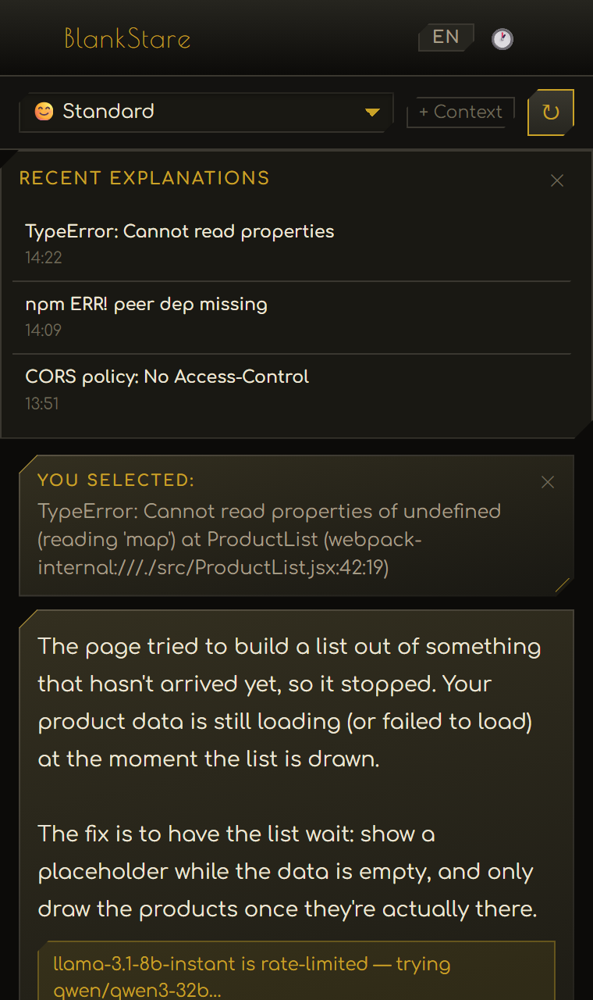

# BlankStare: developer docs and error messages in plain English

**A free Chrome extension that rewrites error messages, READMEs, terminal output and tech jargon into plain English or Greek, in a side panel, while you read.**

📖 **Docs site:** https://docs.stravelakis.com/BlankStare-Dev-English-to-English/ (in Dev, plain English, or ELI5)

## The problem

You're building something with Claude Code, Cursor or ChatGPT, and it hands you
an error you can't read. Or a setup guide that assumes a computer-science
degree. You paste it into a chat, lose your place, and still get an answer
full of the same jargon.

## What it does

- **Rewrites, doesn't annotate.** Select the confusing text; read a plain
  version you can act on, instead of the original.
- **Pitched at you.** Four reading levels, from ELI5 to "I build with AI
  tools", switchable with one click.
- **English or Greek.** The panel, the answers and the read-aloud voice.
- **Names the jargon.** Every technical term with a short meaning.
- **Costs nothing.** Runs on your own free Groq key. Nine free models; if one
  is busy it moves to the next by itself.
- **Asks for little.** Talks to Groq, and to YouTube or your own search server
  only if you set them up.

Also: go deeper, rephrase, full-page summary, follow-up questions, videos and
web search in the panel, the last 20 answers, an exclude list, and keyboard
shortcuts (Alt+Shift+B opens the panel, Alt+Shift+E sends the selection).

## Quick start

1. Download this repo and unzip it.
2. `chrome://extensions` → switch on **Developer mode** → **Load unpacked** →
   pick the folder.
3. Paste a free key from [console.groq.com](https://console.groq.com) into
   Settings → **Test** → **Save Settings**.
4. Select any confusing text and press the brass button.

Full setup: [INSTALL.md](INSTALL.md) · Full manual: [GUIDE.md](GUIDE.md) ·
Docs site: https://docs.stravelakis.com/BlankStare-Dev-English-to-English/

## Screenshots

| In Greek | History | Settings |
|---|---|---|
|  |  |  |

The look is **Deco Noir**, an art-deco identity: a chamfer on two opposing
corners, brass on near-black. Greek titles are set in GFS Didot and Latin ones
in Poiret One, chosen letter by letter. All fonts ship inside the extension;
nothing loads from Google.

## Status

- **Works:** everything listed above. 39 automated tests cover the core logic
  (streaming, link safety, language detection, site exclusion).
- **Not yet:** a Chrome Web Store listing; image and screenshot explanations;
  choosing the voice from the panel.
- **Known rough edge:** Chrome warns that BlankStare can "read and change all
  your data on all websites". The brass button has to be on every page for
  select-to-explain to work; BlankStare only reads your selection.

## For developers

No build step: load the folder and it runs. `npm test` runs the test suite
with Node's own runner, no install needed. `lab/preview.html` shows the panel
without loading the extension, and `node lab/shoot.mjs` regenerates every
screenshot. Architecture and decisions: [HANDOFF.md](HANDOFF.md). Agents:
[CONNECT-AGENTS.md](CONNECT-AGENTS.md).

## Contributing

Issues and PRs welcome:
[bug report](https://github.com/Stravelakis/BlankStare-Dev-English-to-English/issues/new?template=bug_report.md) ·
[feature idea](https://github.com/Stravelakis/BlankStare-Dev-English-to-English/issues/new?template=feature_request.md).
Please read the [Code of Conduct](CODE_OF_CONDUCT.md). Security problems:
[SECURITY.md](SECURITY.md).

## License

**Source available with attribution**, see [LICENSE](LICENSE). Free for
personal use; forks must credit the original author with a link to
[stravelakis.com](https://stravelakis.com); no commercial use without
permission. Third-party credits in [NOTICE](NOTICE).

## About the creator

BlankStare was built by **Lambros Stravelakis** while building
[skilitsa.com](https://skilitsa.com), with Claude Code and the Hermes agent.
Available for web apps, Chrome extensions and AI tools:
[stravelakis.com](https://stravelakis.com) · lambros@stravelakis.com

If BlankStare saves you time: [ko-fi.com/stravelakis](https://ko-fi.com/stravelakis)
